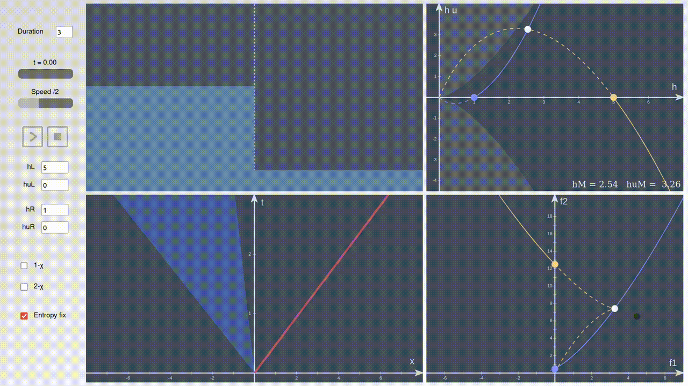

# Math illustrations with `manim`, `matplotlib` and `javascript`

## Runge-Kutta
### Scheme visualization

### Stability region

## B-splines
- Interactive widget showing the basis functions with `matplotlib`
- Interactive widget drawing B-splines in the x-y plane with `matplotlib`

## Riemann solvers
### 1D shallow water equations
Interactive widget available <a href="https://htmlpreview.github.io/?https://github.com/vinzphenix/Math_animations/blob/main/javascript/riemann/riemann.html" target="_blank">here</a>. It displays from left to right, top to bottom:

- The physical situation
- The state space (height, and mass flow rate)
- The space-time diagram with the characteristics
- The mapping from the state space to the flux space

