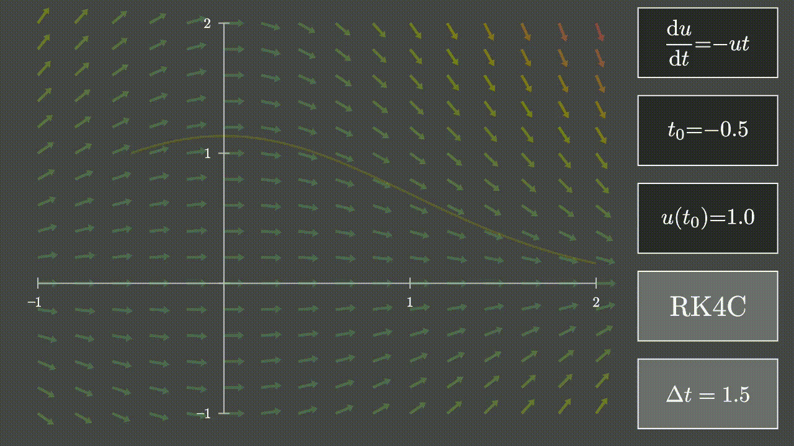
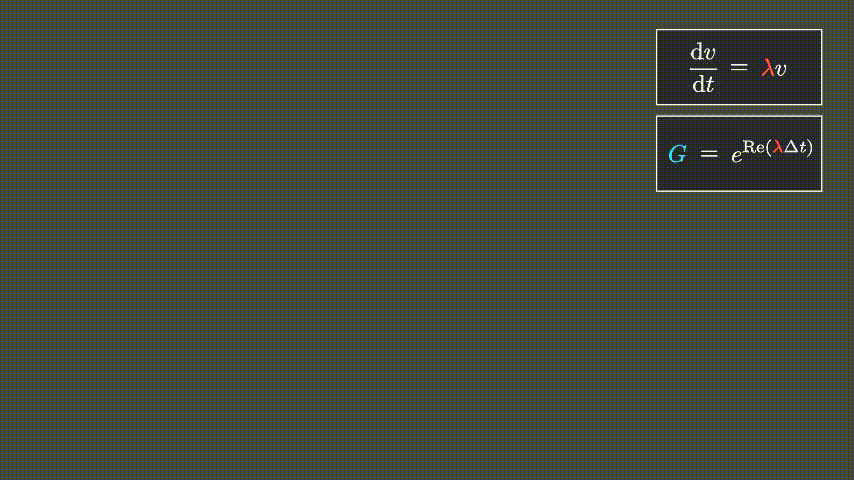
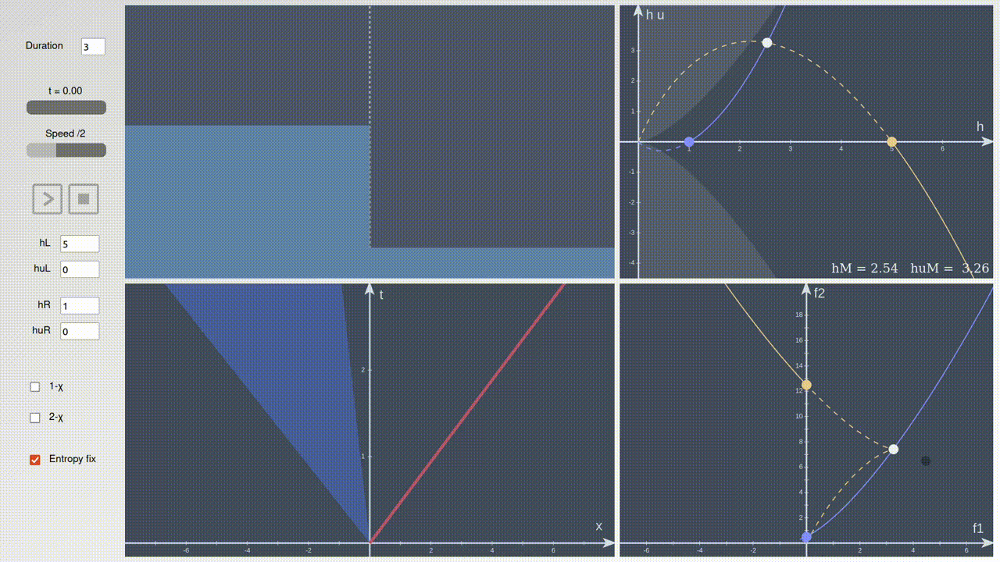
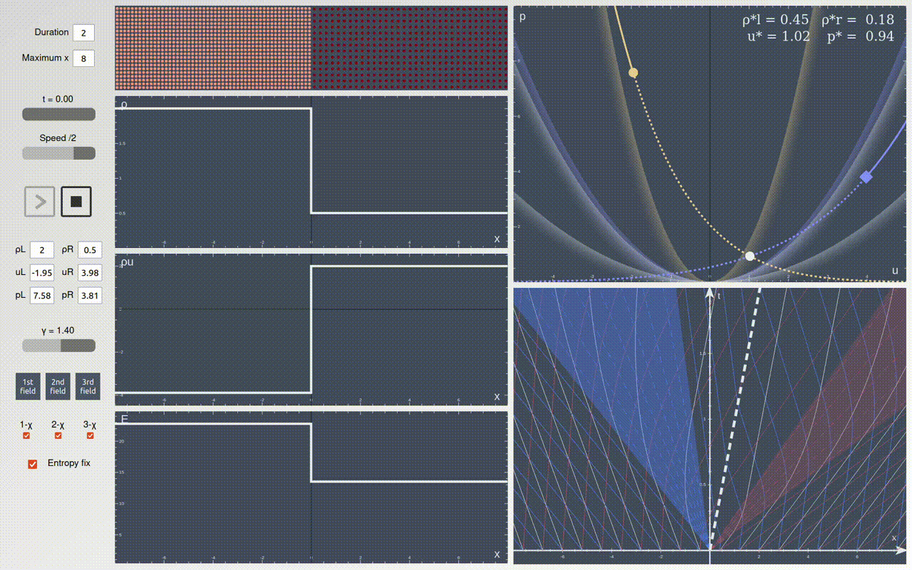
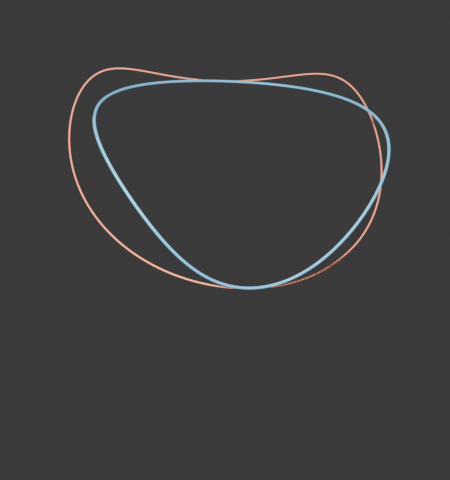

# Math illustrations with `manim`, `matplotlib` and `javascript`

## Runge-Kutta
### Scheme visualization

### Stability region

## B-splines
- Interactive widget showing the basis functions with `matplotlib`
- Interactive widget drawing B-splines in the x-y plane with `matplotlib`

## Riemann solvers
### 1D shallow water equations
Interactive widget available <a href="https://htmlpreview.github.io/?https://github.com/vinzphenix/Math_animations/blob/main/javascript/Shallow_water/shallow_water.html" target="_blank">here</a>. It displays from left to right, top to bottom:

- The physical situation
- The state space (height, and mass flow rate)
- The space-time diagram with the characteristics
- The mapping from the state space to the flux space

### 1D Euler equations of gas dynamics
Interactive widget available <a href="https://htmlpreview.github.io/?https://github.com/vinzphenix/Math_animations/blob/main/javascript/Euler/euler.html" target="_blank">here</a>. It displays:

- In the left column: 3 state variables (primitive, conserved, or others)
- A projection of the state space: velocity and pressure
- The space-time diagram with the characteristics, shocks and rarefaction waves

## Analemma study
Analysis of the Sun's analemma. This wonderful shape depends on
- the Earth axis obliquity,
- the Earth orbit eccentricity,
- the phase delay between both cycles, for example between winter soltice and perihelion.
 
Exact (blue) and approximated (orange) solutions are animated below for fixed obliquity and eccentricity but varying phase delay.

  
  

