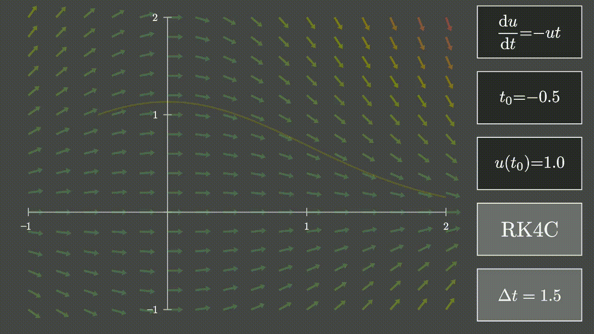
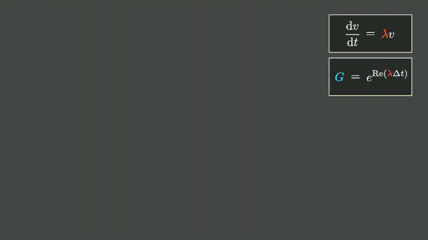

# Explanatory math videos with `manim` and `matplotlib`

## Runge-Kutta
### Scheme visualization

### Stability region

## B-splines
- Interactive widget showing the basis functions with `matplotlib`
- Interactive widget drawing B-splines in the x-y plane with `matplotlib`
